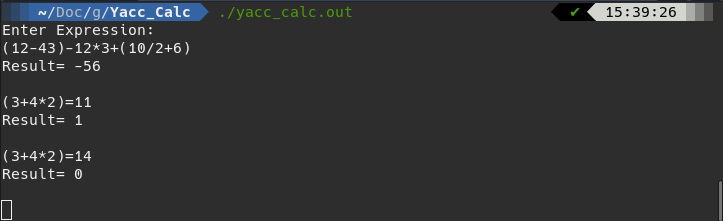

# Yacc Calculator



A simple Calculator written in flex/yacc with multiple arithmetic operators and operator precedence support.

## Compiling

You can compile this project by running the following commands:
```shell
$ flex lexical.l
$ yacc -d parser.y
$ gcc lex.yy.c y.tab.c
```
Then run the compiled executable:
```shell
$ ./a.out
```